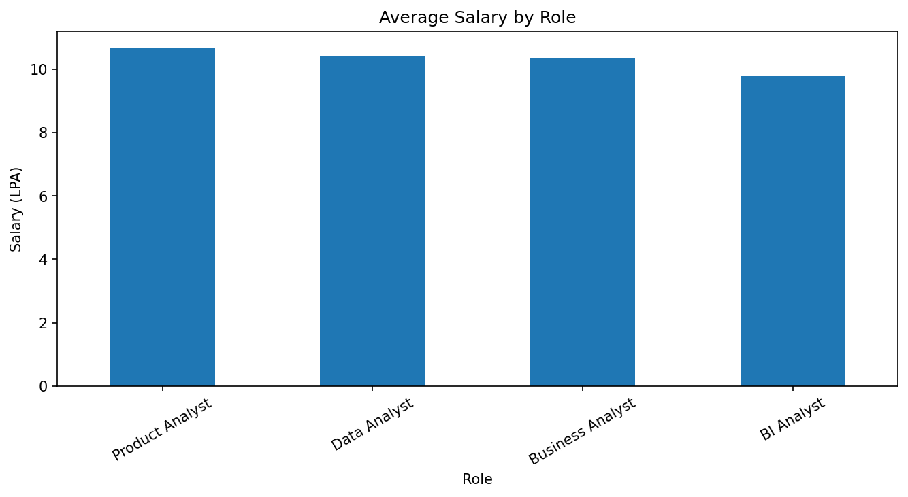
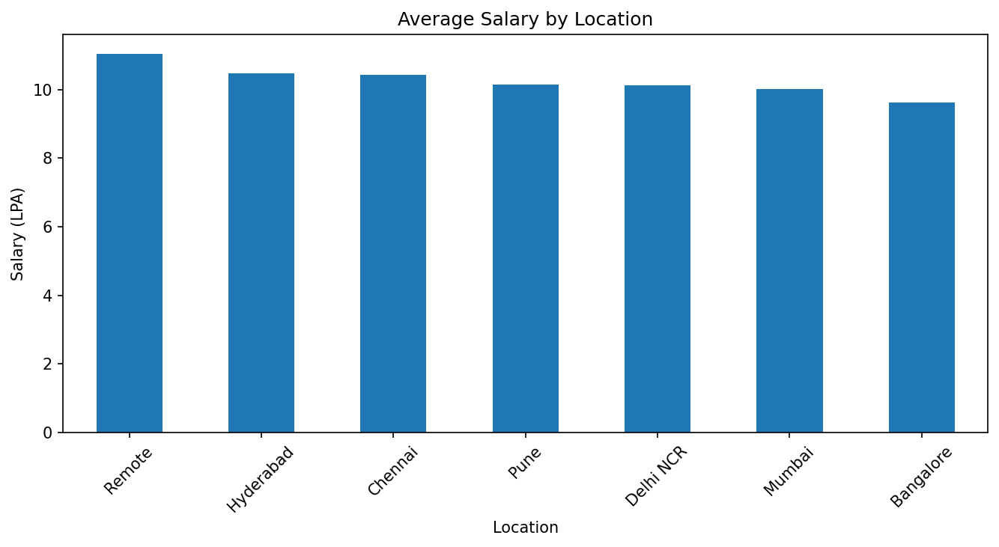
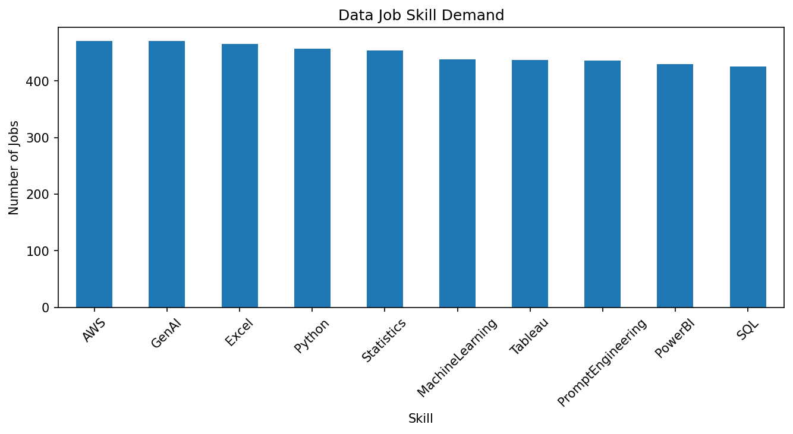

# CareerPulse — Data Analyst Job Market Intelligence

## 📊 Project Overview

CareerPulse is a data analytics project designed to analyze a job-market dataset and identify skill demand, salary patterns, location opportunities, role-wise salary trends, AI skill adoption, and candidate skill gaps.

## 🛠️ Tools Used

- Python
- Pandas
- SQLite
- SQL
- Matplotlib
- Google Colab

## 🔍 Analysis Performed

- Data Cleaning
- Exploratory Data Analysis
- SQL Analysis
- Skill Demand Analysis
- Salary Analysis
- Location Analysis
- Role Analysis
- AI Skill Analysis
- Skill Gap Analysis

## 🎯 Business Questions

1. Which skills are most demanded?
2. Which skills are associated with higher salaries?
3. Which locations provide better opportunities?
4. Which roles have higher average salaries?
5. How significant are AI-related skills?
6. What skills should a candidate prioritize?

## 📈 Key Findings

- Excel was among the highest-demand skills in the analyzed dataset.
- AWS and GenAI showed strong skill demand.
- 188 jobs required both SQL and Python.
- 72 jobs required SQL, Python and Power BI together.
- 504 jobs had salaries above 10 LPA.
- Product Analyst had the highest average salary among the analyzed roles.

## 🧠 Skill Gap Engine

CareerPulse includes a skill-readiness model that compares a candidate's current skills against observed skill demand and identifies high-priority missing skills.

## ⚠️ Dataset Note

This project uses a **synthetic dataset created for analytical methodology demonstration**. The results should not be interpreted as actual Indian job-market statistics.

## 🔄 Workflow

Data → Cleaning → SQL → Analysis → Visualization → Insights → Skill Gap Analysis
## 📊 Visualizations

### Skill Demand

### Salary by Role

### Salary by Location

### AI Skill Demand

